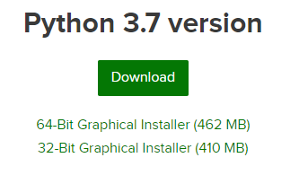

# IS-2020-2-NPA
Repositorio para laboratorio de la materia Ingeniería de Software semestre 2020-2
Práctica 03
## Creación de entorno conda 
Descargar instalador python 3.7  https://www.anaconda.com/distribution/#download-section  

 

 
Una vez instalado conda debemos abrir la terminal y ejecutar el comando:  
**conda create -n mientorno python=3.7**  
Con eso habremos creado el entorno ahora deberemos activar el entorno con el comando:  
**conda activate mientorno**  
Después, importaremos las dependencias de la siguiente forma:  
**conda install --file requirements.txt**
## Creación de proyecto django
Para crear el proyecto django debemos escribir el comando  
**django-admin startproject TuMusica**
Tendremos la siguiente estructura:  
