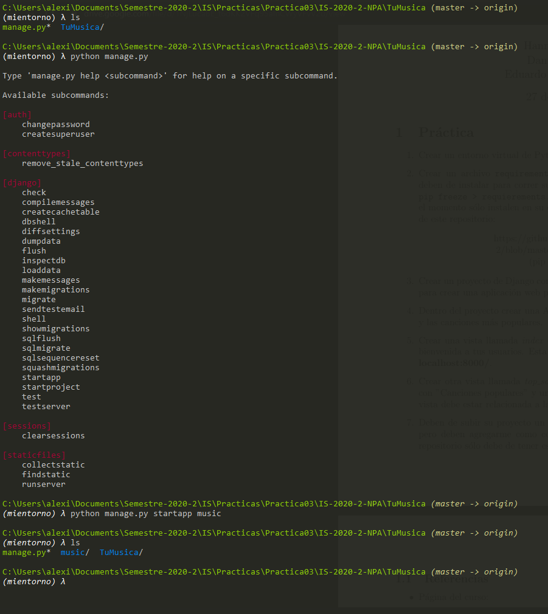
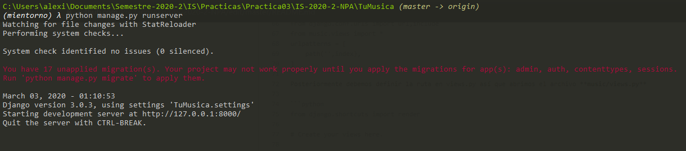
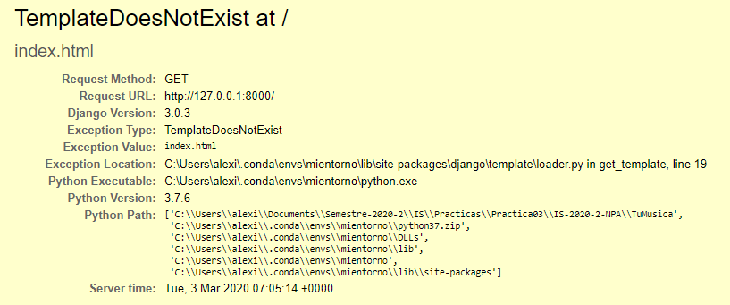
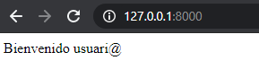
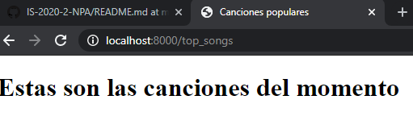

# IS-2020-2-NPA

Repositorio para laboratorio de la materia Ingeniería de Software semestre 2020-2
Práctica 03

## Creación de entorno conda 
Descargar instalador python 3.7  https://www.anaconda.com/distribution/#download-section    

<p align="center"> 

</p>   
 
Una vez instalado conda debemos abrir la terminal y ejecutar el comando:    
**conda create -n mientorno python=3.7 --file requirements.txt**    
Con eso habremos creado el entorno ahora deberemos activar el entorno con el comando:    
**conda activate mientorno**    


Después, importaremos las dependencias de la siguiente forma:    
**conda install --file requirements.txt**  

## Creación de proyecto django  
Para crear el proyecto django debemos escribir el comando    
**django-admin startproject TuMusica**  
Tendremos la siguiente estructura:  
```
─── TuMusica/  
	└── manage.py   
	└── TuMusica/  
``` 
Ahora debemos ejecutar el comando siguiente y obtendremos lo de la imagen  

<p align="center"> 

</p>   
Agregar el módulo music al archivo **TuMusica/setting.py** (dentro de installed apps)  

```python
INSTALLED_APPS = [
    'django.contrib.admin',
    'django.contrib.auth',
    'django.contrib.contenttypes',
    'django.contrib.sessions',
    'django.contrib.messages',
    'django.contrib.staticfiles',
    'music',
]
# y para los templates
TEMPLATES = [
    {
        'BACKEND': 'django.template.backends.django.DjangoTemplates',
        'DIRS': [os.path.join(BASE_DIR,'templates')],
        'APP_DIRS': True,
        'OPTIONS': {
            'context_processors': [
                'django.template.context_processors.debug',
                'django.template.context_processors.request',
                'django.contrib.auth.context_processors.auth',
                'django.contrib.messages.context_processors.messages',
            ],
        },
    },
]
```
Ahora nuestro archivo **TuMusica/urls.py**  deberá quedar de la siguiente forma  

```python
#
from django.contrib import admin
from django.urls import path, include

urlpatterns = [
    path('admin/', admin.site.urls),
    path('', include('music.urls') ),
]
```

Ahora debemos ir la carpeta music y crear un archivo **urls.py** aquí definiremos las rutas del módulo  por lo que tendríamos el siguiente código:  

```python
from django.urls import path
from django.conf.urls import url,include
from music.views import *
urlpatterns = [
    path('',index),
]
```  
Posteriormente debemos definir la ruta en views.py así que abrimos el archivo **music/views.py**  

```python
from django.shortcuts import render

# Create your views here.

def index(request):
    if request.method == 'GET':
        return render(request,'index.html')
    elif request.method == 'POST':
        return HttpResponseForbidden()
```  
De ésta forma ya solo nos faltaría definir nuestro html para la primera vista, pero si intentamos correr el proyecto pasaría lo siguiente:

<p align="center"> 

</p>  

<p align="center"> 

</p>  

Creamos el template index.html de momento dentro de la misma carpeta de **music**  

```html
<!DOCTYPE html>
<html>
<head>
	<title>Index</title>
</head>
<body>
	Bienvenido usuari@
</body>
</html>
```    
Si vamos a http://127.0.0.1:8000/ obtendremos lo siguiente: 

<p align="center"> 

</p>  

Ahora crearemos otra vista para renderizar el segundo template, nos regresamos al archivo **music/urls.py**  

```python
from django.urls import path
from django.conf.urls import url,include
from music.views import *
urlpatterns = [
    path('',index),
    path('top_songs', songs),
]
```    

Y posteriormente al archivo **music/views.py**

```python
def songs(request):
    if request.method == 'GET':
       	return render(request,'top_songs.html')
    elif request.method == 'POST':
        print("entra a index post")
        return HttpResponseForbidden()
```

Agregamos a templates el top_songs.html  

```html
<!DOCTYPE html>
<html>
<head>
	<title>Canciones populares</title>
</head>
<body>
	<h1>Estas son las canciones del momento</h1>
</body>
</html>
```  
Volvemos a correr el servidor obteniendo:   
<p align="center"> 

</p> 
